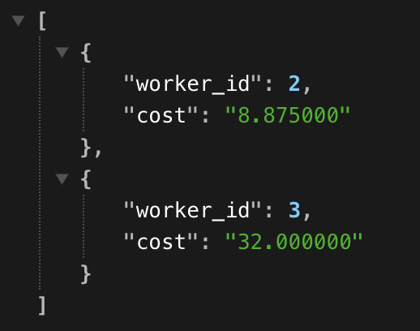
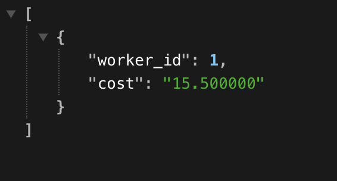

# Installation

## Docker

To set up the environment, you will need to first install [Docker](https://docs.docker.com/engine/install/).
This test uses Docker Compose to run everything.

## Backend Server

The backend server uses Node.js, but you don't need to have that installed on your machine. You can install
the dependencies by running:

```bash
docker compose run server npm i
```

## Database

To bring up the database:

```bash
docker compose up -d db
```

Once it's ready to go, you can run the schema migrator to build the schema:

```bash
docker compose run migrate
```

If that fails (because of something like an already existing table), you can always start with a clean slate
by bringing the DB container down:

```bash
docker compose down
```

## RESULT

If everything goes well with the setup you should be able to run the server locally and in your browser you should be able to run "http://localhost:3000/" and see:


Also if you navigate to /worker endpoint via "http://localhost:3000/worker?workerIds=1,2,3&isComplete=false" you should see:


similarly, if you run: "http://localhost:3000/worker?workerIds=1,2,3&isComplete=true" you should see the result as:


same for "/location" endpoints

## TODO

This is a quick demo of what can be done, there are many things that can be improved. such as:
    - Using better approach to generate and use data such as ORM method
    - Having integration test using a seperate Docker for testing
    - Optimising Queries for more readability and performance
    - More efficient error handling, custome errors and approaches to handle an error